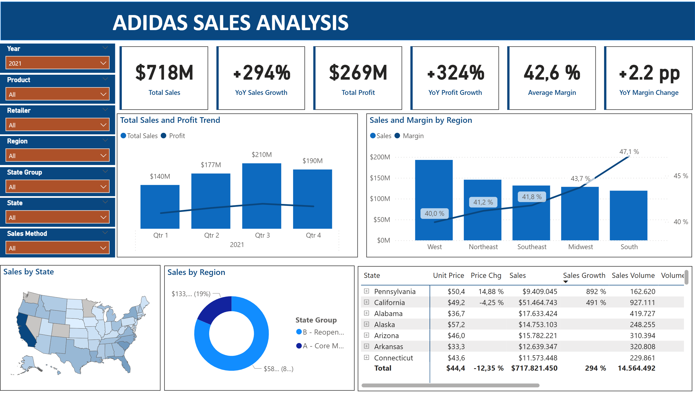
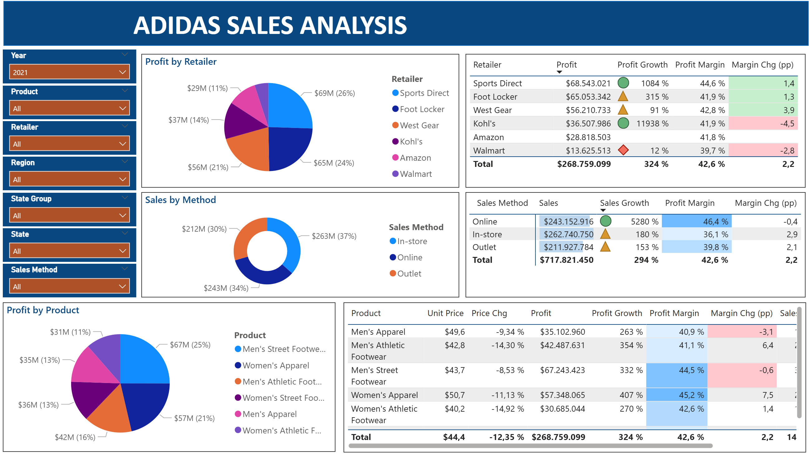

# 🏷️ **Adidas USA Vertriebsanalyse 2020 - 2021**

Dieses Projekt untersucht die Verkaufs- und Profitabilitätsdaten von **Adidas** auf dem US-Markt in den Jahren **2020 – 2021**.  
Ziel ist es, zentrale **Wachstumstreiber** und **potenzielle Risiken** zu identifizieren, um **datenbasierte Handlungsempfehlungen** für eine nachhaltige Wachstumsstrategie abzuleiten.

---

## 🎯 **Projektmotivation**

Im Jahr **2021** erzielte Adidas in den USA ein außergewöhnliches Wachstum:  
📈 **Umsatz +294 %**, **Gewinn +324 %**

**Zentrale Geschäftsfrage:**  
> Ist dieses Wachstum nachhaltig – oder stark von kurzfristigen Sondereffekten abhängig?

---

## 📊 **Projektumfang und Datengrundlage**

- **Zeitraum:** 2020–2021 (inkl. Vorjahresvergleiche)  
- **Region:** US-Markt  
- **Kernkennzahlen:** Umsatz, Gewinn, Gewinnmarge, Absatzmenge, Durchschnittspreis sowie deren Wachstumsraten  
- **Datenhinweis:**  
  Die Analyse beinhaltet keine Kundensegmentierungs- oder Marketingdaten;  
  alle Ergebnisse basieren ausschließlich auf **Verkaufs- und Finanzkennzahlen**.

---

## 🧹 **Datenbereinigung und Vorbereitung**

- 🔧 **Korrektur fehlerhafter Händlerzuordnungen**, um eine exakte Kanalanalyse zu gewährleisten  
- 🧩 **Entfernung logisch widersprüchlicher Datensätze** (z.B. Transaktionen mit 0 Umsatz, aber positiver Marge)  
- 📏 **Datenkonsistenz:** Bei Umsatz- und Volumendaten lag eine Abweichung in der Berechnungslogik vor, daher wurde zur Korrektur das Feld „Adjusted Units Sold “ eingeführt.

---

## 💡 **Zentrale Erkenntnisse**

- **81 % des Wachstums** stammen aus neu geöffneten *„Reopening States“ (Gruppe B)* – ein pandemiebedingter Sondereffekt  
- **Bestandsmärkte (Gruppe A)** verzeichneten einen Umsatzrückgang von **–26 %**, was strukturelle Risiken offenlegt  
- **Online-Kanal** weist die **höchste Profitabilität** auf (durchschnittliche Gewinnmarge **46,4 %**), ist in A-Märkten jedoch **unterrepräsentiert**  

---

## 📊 **Dashboard**

---

## 🧭 **Strategische Empfehlungen**

### 1️⃣ **Stärkung der Bestandsmärkte (Gruppe A)**  
- Prioritäre Analyse der Produktverfügbarkeit und Allokationsstrategie, die ein möglicher Haupttreiber des Schrumpfens der A-Gruppe ist.
- Optimierung von Preis- und Kanalstrategien  
- **Ziel:** Marktanteil stabilisieren und Profitabilität wiederherstellen  

### 2️⃣ **Ausbau des Online-Kanals**  
- Erhöhung der Online-Penetration in Bestandsmärkten  
- **Ziel:** Skalierbares, margenstarkes Wachstum  

### 3️⃣ **Optimierung des Händlerportfolios**  
- Vertiefung der Partnerschaften mit etablierten Top-Partnern (Foot Locker, Sports Direct) sowie aufstrebenden Händlern (Kohl's, Amazon) 
- **Risikomanagement** bei schwächeren Partnern (z. B. **Walmart**)  
- **Ziel:** Verbesserung der Kanalqualität und Gesamtprofitabilität  

---

## ⚙️ **Analytischer Ansatz**

1. **Makroanalyse** – Erkennung zentraler Trends und Ausreißer  
2. **Kreuzanalyse** – Kombination mehrerer Dimensionen zur Ursachenfindung  
3. **Tiefenanalyse** – Ableitung konkreter Maßnahmen und Handlungsempfehlungen  

---

## 🧠 **Technische Umsetzung**

- 🧾 **Datenaufbereitung:** Microsoft **Power Query**  
- 📈 **Analyse & Modellierung:** **DAX** (Data Analysis Expressions)  
- 💡 **Visualisierung & Reporting:** **Power BI**

---

## 📁 **Projektergebnisse**

[➡ **Vollständiger Analysebericht (PDF)**](./adidas-us-report.pdf)  
[➡ **Interaktives Power BI-Dashboard**](./adidas%20sales%20analysis.pbix)
